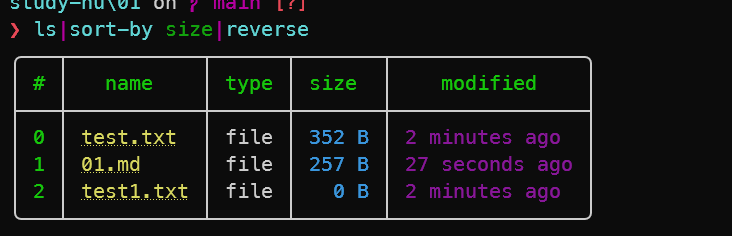
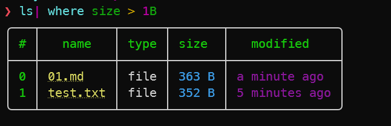
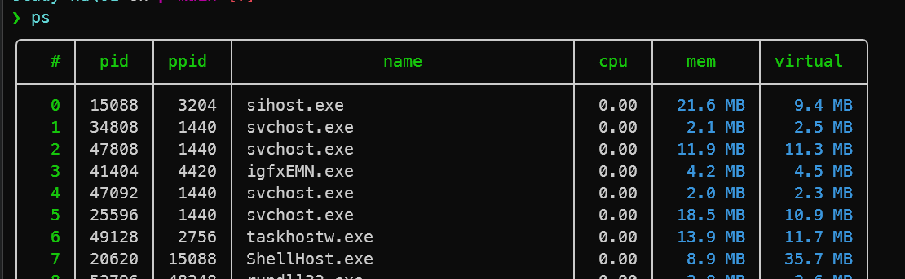
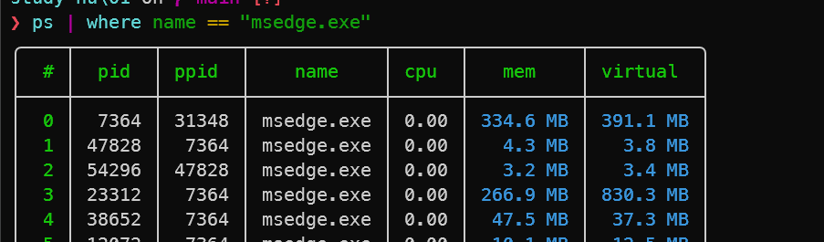

# 对数据进行操作

我们使用 Nushell 的内置命令 [`sort-by`](https://www.nushell.sh/commands/docs/sort-by.html) 来对 `ls` 命令的*输出*进行排序。然后，为了让最大的文件显示在最上面，


```nu
ls | sort-by size | reverse
```



# 使用 where 命令查找数据

```nu
ls| where size > 1B
```



# 不仅仅是目录

Nushell 提供了一个跨平台的内置 ps 命令



也可以进行判断

```
ps | where name == "msedge.exe"
```



describe 命令可以用来显示任何命令或表达式的输出类型


```
❯ ps | describe
table<pid: int, ppid: int, name: string, cpu: float, mem: filesize, virtual: filesize> (stream)
```


#  管道中的命令参数

```
❯ ls | sort-by size |reverse |first|get name |cp $in ~
```

1. 先把当前目录里所有东西扫一遍，看看谁**占空间最大**。
2. 找到之后，**不做任何改动**，直接把它**原样复制**到你的家目录（就是打开“文件资源管理器”时左边那个“用户→你的用户名”的文件夹，Linux/mac 里叫 `~`）。

# 获取帮助

```
# help <command>
help ls
# 或者
ls --help
# 也可以
help operators
help escapes
```


